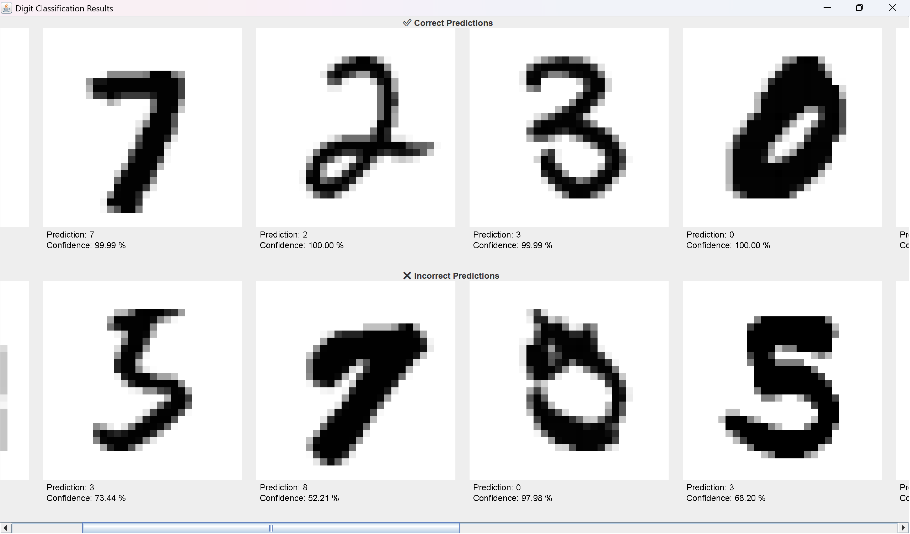

# Neural Network in plain Java

This project implements a feed-forward neural network **from scratch in Java** without using external ML libraries.  
The network is trained and evaluated on the [MNIST dataset](https://www.kaggle.com/datasets/hojjatk/mnist-dataset) of handwritten digits.

## Features
- Fully connected neural network with **ReLU** and **Softmax** activations
- **Cross-entropy** loss function
- Mini-batch stochastic gradient descent (SGD)
- **He initialization** for weight parameters
- Early stopping with patience-based strategy
- Supports customizable network architectures (e.g., 784-64-32-10)
- Model saving and loading in **JSON** format
- Visualization of correctly and incorrectly classified digits with confidence scores
- **Memory-efficient design**: reduced garbage collection overhead by minimizing dynamic allocations

## Results

|   | Architecture     | Test Accuracy | Epochs | Training Time | Average Confidence | Av. Wrong Confidence | Av. Correct Confidence |
|---|------------------|---------------|--------|---------------|--------------------|----------------------|------------------------|
| 1 | 784-16-10        | 95.16 %       | 69     | 115 s         | 94.60 %            | 67.59 %              | 95.98 %                |
| 2 | 784-64-32-10     | 97.24 %       | 50     | 320 s         | 97.33 %            | 70.52 %              | 98.10 %                |
| 3 | 784-128-64-32-10 | 97.58 %       | 50     | 671 s         | 98.93 %            | 81.31 %              | 99.37 %                |


Training was done with **learning rate** 0.01, **mini-batch** size of 1000, **validation set** 10 000, and **patience** 10 steps.

## Example Visualization
Correctly and incorrectly classified digits are displayed in a scrollable window with their predicted confidence:

  

## Model Saving / Loading
The trained model can be saved in **JSON** format.

Example JSON structure:
```json
{
  "sizes":[784,16,10],
  "weights": [
    [[...], [...], ...],
    ...
  ],
  "biases": [
    [...],
    ...
  ]
}
