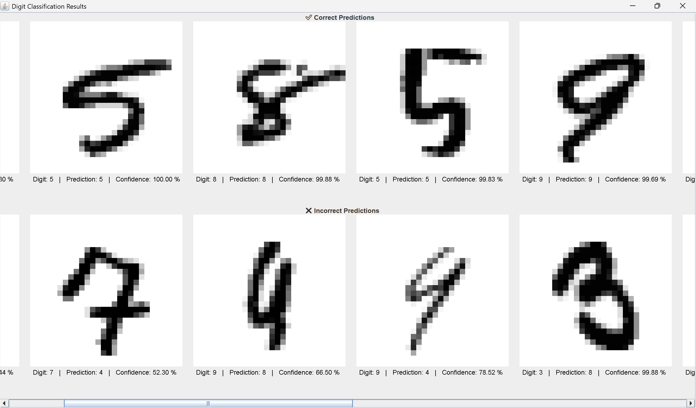

# 🕸️ Neural Network in plain Java


---
This project implements a feed-forward neural network **from scratch in Java** without using external ML libraries.  
The network is trained and evaluated on the [MNIST dataset](https://www.kaggle.com/datasets/hojjatk/mnist-dataset)
of handwritten digits, but could also be used for any other classification purposes (see [Further use](#further-use)). 


---

## 🏛️ Architecture
- Fully connected neural network with **ReLU** and **Softmax** activations
- **Cross-entropy** loss function
- **He initialization** for weight parameters
- Supports customizable network architectures (e.g., 784-64-32-10)
- See [THEORY.md](docs/THEORY.md)

---

## ✨ Features
- Mini-batch stochastic gradient descent (SGD)
- Early stopping with patience-based strategy
- Model saving and loading in **JSON** format
- Visualization of correctly and incorrectly classified digits with confidence scores
- **Memory-efficient design**: reduced garbage collection overhead by minimizing dynamic allocations

---

## 📊 Results

|   | Architecture     | Test Accuracy | Epochs | Training Time | Average Confidence | Av. Wrong Confidence | Av. Correct Confidence |
|---|------------------|---------------|--------|---------------|--------------------|----------------------|------------------------|
| 1 | 784-16-10        | 95.16 %       | 69     | 115 s         | 94.60 %            | 67.59 %              | 95.98 %                |
| 2 | 784-64-32-10     | 97.24 %       | 50     | 320 s         | 97.33 %            | 70.52 %              | 98.10 %                |
| 3 | 784-128-64-32-10 | 97.58 %       | 50     | 671 s         | 98.93 %            | 81.31 %              | 99.37 %                |


Training was done with 
- **learning rate** 0.01
- **mini-batch** size of 1000
- **validation set** 10 000
- **patience** 10 steps

---

## 🖼️ Example Visualization
Correctly and incorrectly classified digits are displayed in a scrollable window with their predicted confidence:



---

## ⚙️ Setup

Requirements:
- Java 17+
- Maven

Clone and run:
```bash
git clone https://github.com/vektor-y/MnistDigitsRecognition.git
cd MnistDigitsRecognition
mvn clean install
mvn exec:java -Dexec.mainClass="nika.ml.mnist.Main"
```
> 💡 *All dependencies are standard Java libraries + Jackson (managed via Maven).*

---

## ⚡ Demo vs Full Training

By default, running the project uses a **tiny built-in demo subset** of MNIST (stored in `src/main/resources/demo`).  
This allows anyone to run the project instantly without downloading the dataset.

To train on the **full MNIST dataset**:
1. Download the dataset from [Kaggle](https://www.kaggle.com/datasets/hojjatk/mnist-dataset)
2. Place the files in `MnistDigitsRecognition/data/mnist/`
3. Run the same command — the project will automatically detect and use the full dataset.

---

## 🧠 Pre-trained Models

The `models/` folder contains pre-trained neural networks from the above table you can use right away.
See [Model Saving / Loading](#-model-saving--loading).

---

## 📁 Project Structure

```bash
MnistDigitsRecognition/
├── src/
│   ├── main/
│   │   ├── java/           # Core implementation
│   │   └── resources/
│   │       └── demo/       # Small demo subset of MNIST
├── data/
│   └── mnist/              # (optional) full dataset
├── models/                 # saved neural networks
├── docs/
│   └── THEORY.md
├── pom.xml
└── README.md
```

---

## 🚀 Quick Start

Create a network:
```java
    NeuralNetwork net = new NeuralNetwork(784, 64, 32, 10);
```

Get samples:
```java
    int[][] trainImages = MnistImageReader.readImages("data/mnist/train-images.idx3-ubyte");
    int[] trainLabels = MnistImageReader.readLabels("data/mnist/train-labels.idx1-ubyte");
    
    int[][] testImages = MnistImageReader.readImages("data/mnist/t10k-images.idx3-ubyte");
    int[] testLabels = MnistImageReader.readLabels("data/mnist/t10k-labels.idx1-ubyte");
```

Train and test:
```java
    MnistTraining training = new MnistTraining(net);
    training.train(trainImages, trainLabels, 0.01, 100, 1000, 10_000, 10);
    training.test(testImages, testLabels);
```

Test:
```java
    EvalResults results = net.test(MnistTraining.normalizeInput(images), labels);
    System.out.println(results);
```

Display:
```java
    DigitViewer.showDigits(results, SIZE);
```

---

## 💾 Model Saving / Loading
The trained model can be saved in **JSON** format as shown above.

Save:
```java
    net.save();
    // or
    net.save("models/your-filename.json");
```

Load:
```java
    NeuralNetwork net = NeuralNetwork.load("models/NN-784-64-32-10.json");
```
Example JSON structure:
```json
{
  "sizes":[784,16,10],
  "weights": [
    [["..."], ["..."], "..."],
    "..."
  ],
  "biases": [
    ["..."],
    "..."
  ]
}
```

---

## 🧪 Further use

In order to train and use a network for other classification purposes, you only have to provide an array `double[][]` 
of (better normalized) inputs and an array of labels `int[]` as samples, where each label corresponds to an integer 
from `[0, number of classes - 1]`.

```java
static double[][] normalizeInput(int[][] images) {
    double[][] res = new double[images.length][images[0].length];
    for (int i = 0; i < images.length; ++i) {
        for (int j = 0; j < images[i].length; ++j) {
            res[i][j] = images[i][j] * 1.0 / 255;
        }
    }
    return res;
}

public static void main(String[] args) {
    NeuralNetwork net = NeuralNetwork.load("models/NN-784-64-32-10.json");
    images = MnistImageReader.readImages("data/mnist/t10k-images.idx3-ubyte");
    labels = MnistImageReader.readLabels("data/mnist/t10k-labels.idx1-ubyte");
    System.out.println(net.test(normalizeInput(images), labels));
}
```