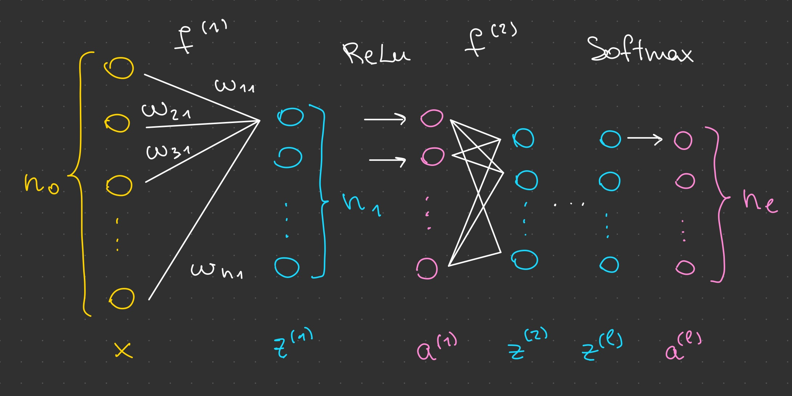

# The Maths behind the Model

A neural network is just a composition of functions.
To train a network means, adjust the function parameters to find a local minimum of the loss function.

## Architecture

Let $l$ be the number of layers in the network and $n_l=C$ the number of classification classes.

### Layers:

- $x \in \mathbb{R}^{n_0}$ - input vector
- $z^{(k)} \in \mathbb{R}^{n_k}$ - k-th layer after applying weights and biases
- $a^{(k)} \in \mathbb{R}^{n_k}$ - after applying activation functions

### Parameters:

- $W^{(1)},\ W^{(2)},\ \dots,\ W^{(l)}$ - weights matrices
- $b^{(1)},\ b^{(2)},\ \dots,\ b^{(l)}$ - biases vectors

### Functions:

- $f^{(1)},\ f^{(2)},\ \dots,\ f^{(l)}$ - affin linear functions
- $ReLu$ - activation functions
- $Softmax$ - final normalizing activation function
- $\text{CE}$ - cross entropy (loss function)

### How layers are defined

Let $W^{(1)} =: W =
\begin{bmatrix} w_{11} & w_{12} & \dots & w_{1n_1} 
\\ \vdots & \vdots & & \vdots 
\\ w_{n_01} & w_{n_02} & \dots & w_{n_0n_1} \end{bmatrix}$ and $b := b^{(1)}$.

This matrix contains the connections between the input vector and the first layer. So for example,
$w_{21}$ represents the connection between the second entry of the input vector $x$ and the first entry of the first layer $z^{(1)}$.
The influence of the input on the first entry in the first layer is naturally defined as:
$$z^{(1)}_1 := \sum_{i=1}^{n_0} w_{i1}x_i + b_1 = \langle W_{-,1},\ x \rangle + b_1 =  \langle W_{1,-}^T,\ x \rangle + b_1$$
and therefore:
$$ z^{(1)} = W^Tx + b = (W^{(1)})^Tx + b^{(1)} =: f^{(1)}(x)$$
Then we apply activation function:
$$ a^{(1)} = ReLu(z^{(1)}) = \begin{bmatrix} max(0,\ z^{(1)}_1) \\ \vdots \\ max(0,\ z^{(1)}_{n_1}) \end{bmatrix}$$
Generally:
- $z^{(1)} := f^{(1)}(x)$
- $z^{(k)} := f^{(k)}(a^{(k-1)}) = (W^{(k)})^Ta^{(k-1)} + b^{(k)},\ k \in \{2,\ \dots,\ l\}$
- $a^{(k)} := ReLu(z^{(k)}),\ k \in \{1,\ \dots,\ l-1\}$
- $a^{(l)} := Softmax(z^{(l)})$, where

$$ Softmax(z) = \frac{1}{\sum_{i=1}^{C}\exp(z_i)}\begin{bmatrix} \exp({z_1}) \\ \vdots \\ \exp({z_{C}}) \end{bmatrix}$$
Note, that all entries of the output vector are positive and sum up to 1, which corresponds to the probability properties.

Finally, the loss function is defined as followed:
$$ \text{CE}(y, \hat{y}) = -\sum_{i=1}^{C} \hat{y_i} \log y_i $$
where $y = a^{(l)}$ is the output of the network and $\hat{y}$ is the goal vector
($\hat{y_i} = 1$ when the input belongs to the class $i$ and $0$ otherwise). 
